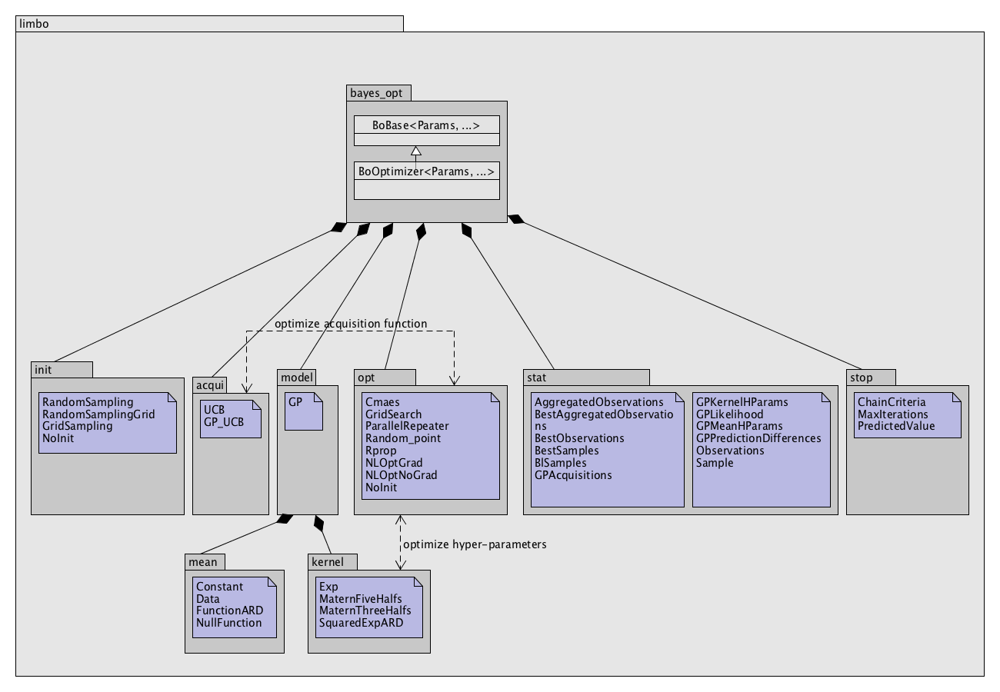
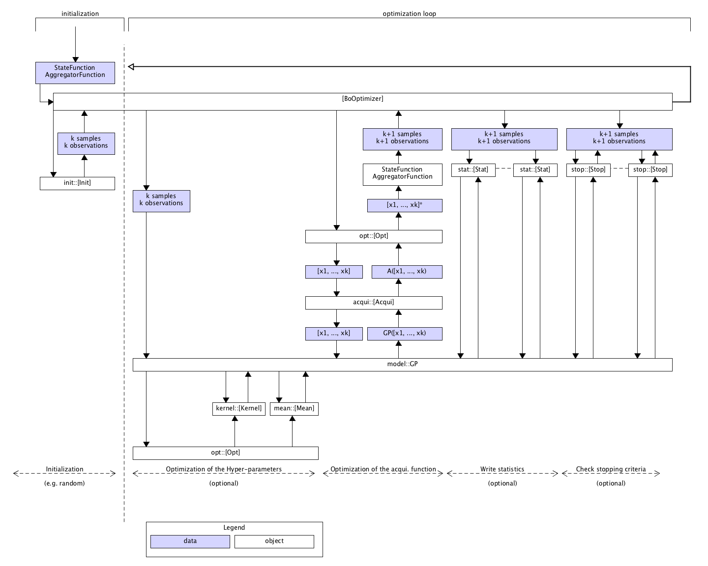

API
============
.. highlight:: c++

Limbo follows a  `policy-based design <https://en.wikipedia.org/wiki/Policy-based_design>`_, which allows users to combine high flexibility (almost every part of Limbo can be substituted by a user-defined part) with high performance (the abstraction do not add any overhead, contrary to classic OOP design). These two features are critical for researchers who want to experiment new ideas in Bayesian optimization. This means that changing a part of limbo (e.g. changing the kernel functions) usually corresponds to changing a template parameter of the optimizer.

The parameters of the algorithms (e.g. an epsilon) are given by a template class (usually called Params in our code, and always the first argument). See :doc:`guides/parameters` for details.

To avoid defining each component of an optimizer manually, Limbo provides sensible defaults. In addition, Limbo relies on `Boost.Parameter <http://www.boost.org/doc/libs/1_60_0/libs/parameter/doc/html/index.html>`_  to make it easy to customize a single part. This Boost library allows us to write classes that accept template argument (user-defined custom classes) by name. For instance, to customize the stopping criteria:

::

  using namespace limbo;

  // here stop_t is a user-defined list of stopping criteria
  bayes_opt::BOptimizer<Params, stopcrit<stop_t>> boptimizer;

Or to define a custom acquisition function:

::

  using namespace limbo;

  // here acqui_t is a user-defined acquisition function
  bayes_opt::BOptimizer<Params, acquifun<acqui_t>> boptimizer;

Class Structure
---------------

   Click on the image to see it bigger.

There is almost no explicit inheritance in Limbo because polymorphism is not used. However, each kind of class follow a similar template (or 'concept'), that is, they have to implement the same methods. For instance, every initialization function must implement a `()` method:

.. code-block:: cpp

  template <typename StateFunction, typename AggregatorFunction, typename Opt>
  void operator()(const StateFunction& seval, const AggregatorFunction&, Opt& opt) const

However, there is no need to inherit from a particular 'abstract' class.

Every class is parametrized by a :ref:`Params <params-guide>` class that contains all the parameters.

Sequence diagram
---------------

   Click on the image to see it bigger.

File Structure
--------------
(see below for a short explanation of the concepts)

..highlight:: none

::

  src
  +-- limbo:
       +-- acqui: acquisition functions
       |-- bayes_opt: bayesian optimizers
       |-- init: initialization functions
       |-- kernel: kernel functions
       |-- mean: mean functions
       |-- model: models (Gaussian Processes)
       |-- opt: optimizers (Rprop, CMA-ES, etc.)
       |-- stat: statistics (to dump data)
       |-- stop: stopping criteria
       |-- tools: useful macros & small functions
  |-- tests: unit tests
  |-- benchmarks: a few benchmark functions
  |-- examples: a few examples
  |-- cmaes: [external] the CMA-ES library,
      used for inner optimizations -- from https://www.lri.fr/~hansen/cmaesintro.html
  |-- ehvi: [external] the Expected HyperVolume Improvement,
      used for Multi-Objective Optimization -- by Iris Hupkens

.. highlight:: c++

Each directory in the `limbo` directory corresponds to a namespace with the same name. There is also a file for each directory called "*directory*.hpp" (e.g. ``acqui.hpp``) that includes the whole namespace.

Bayesian optimizers (bayes_opt)
---------------------------------
.. doxygenclass:: limbo::bayes_opt::BoBase
  :members:

.. doxygenclass:: limbo::bayes_opt::BOptimizer
  :members:

Acquisition functions (acqui)
------------------------------

An acquisition function is what is optimized to select the next point to try. It usually depends on the model.

Template
^^^^^^^^^^
.. code-block:: cpp

  template <typename Params, typename Model>
  class AcquiName {
  public:
      AcquiName(const Model& model, int iteration = 0) : _model(model) {}
      size_t dim_in() const { return _model.dim_in(); }
      size_t dim_out() const { return _model.dim_out(); }
      template <typename AggregatorFunction>
      double operator()(const Eigen::VectorXd& v, const AggregatorFunction& afun) const
      {
        // code
      }
    };

Available acquisition functions
^^^^^^^^^^^^^^^^^^^^^^^^^^^^^^^^
.. doxygengroup:: acqui
  :undoc-members:

Default Parameters
^^^^^^^^^^^^^^^^^^^
.. doxygengroup:: Acqui_defaults
  :undoc-members:

Init functions (init)
------------------------------
Initialization functions are used to inialize a Bayesian optimization algorithm with a few samples. For instance, we typically start with a dozen of random samples.

Template
^^^^^^^^^^

.. code-block:: cpp

  struct InitName {
      template <typename StateFunction, typename AggregatorFunction, typename Opt>
      void operator()(const StateFunction& seval, const AggregatorFunction&, Opt& opt) const
      {
       // code
      }

Available initializers
^^^^^^^^^^^^^^^^^^^^^^
.. doxygengroup:: init
  :undoc-members:

Default Parameters
^^^^^^^^^^^^^^^^^^^^

.. doxygengroup:: init_defaults
  :undoc-members:

Optimization functions (opt)
------------------------------
Optimizers are used both to optimize acquisition functions and to optimize hyper-parameters. Some optimizers require the gradient, some don't.

Template
^^^^^^^^^

.. code-block:: cpp

  template <typename Params>
  struct OptimizerName {
    template <typename F>
    Eigen::VectorXd operator()(const F& f, const Eigen::VectorXd& init, bool bounded) const
    {
      // content
    }
  };

- ``f`` is the function to be optimized. If the gradient is known, the function should look like this:

.. code-block:: cpp

  limbo::opt::eval_t my_function(const Eigen::VectorXd& v)
  {
    double x = <function_value>;
    Eigen::VectorXd gradient = <gradient>;
    return std::make_pair(x, gradient);
  }

- If the gradient of ``f`` is not known:

.. code-block:: cpp

  limbo::opt::eval_t my_function(const Eigen::VectorXd& v)
  {
    double x = <function_value>(v);
    return limbo::opt::no_grad(x);
  }

- ``init`` is an optionnal starting point (for local optimizers); many optimizers ignore this argument (see the table below): in that case, an assert will fail.
- ``bounded`` is true if the optimization is bounded in [0,1]; many optimizers do not support bounded optimization (see the table below).

+-------------+---------+-------+
|Algo.        | bounded |  init |
+=============+=========+=======+
|CMA-ES       | yes     | yes   |
+-------------+---------+-------+
| NLOptGrad   | ?       |   ?   |
+-------------+---------+-------+
| NLOptNoGrad | ?       |    ?  |
+-------------+---------+-------+
|Rprop        | no      | ?     |
+-------------+---------+-------+
|RandomPoint  | yes     | no    |
+-------------+---------+-------+

Available optimizers
^^^^^^^^^^^^^^^^^^
.. doxygengroup:: opt
   :undoc-members:

Default parameters
^^^^^^^^^^^^^^^^^^^
.. doxygengroup:: opt_defaults
   :undoc-members:

Utility functions & typedefs
^^^^^^^^^^^^^^^^^^^^^^^^^^^^^^

.. doxygengroup:: opt_tools
   :members:

Models / Gaussian processes (model)
---------------
Currently, Limbo only includes Gaussian processes as models. More may come in the future.

.. doxygenclass::  limbo::model::GP
   :members:

The hyper-parameters of the model (kernel, mean) can be optimized. The following options are possible:

.. doxygengroup:: model_opt
  :members:

Kernel functions (kernel)
--------------------------

Template
^^^^^^^^
.. code-block:: cpp

  template <typename Params>
  struct Kernel {
    Kernel(size_t dim = 1) {}
    double operator()(const Eigen::VectorXd& v1, const Eigen::VectorXd& v2) const
    {
        // code
    }
  };

Available kernels
^^^^^^^^^^^^^^^^^^
.. doxygengroup:: kernel
   :members:

Default parameters
^^^^^^^^^^^^^^^^^^^
.. doxygengroup:: Kernel_defaults
   :undoc-members:

Mean functions (mean)
--------------------------

Mean functions capture the prior about the function to be optimized.

Template
^^^^^^^^

.. code-block:: cpp

  template <typename Params>
  struct MeanFunction {
    MeanFunction(size_t dim_out = 1) : _dim_out(dim_out) {}
    template <typename GP>
    Eigen::VectorXd operator()(const Eigen::VectorXd& v, const GP&) const
    {
        // code
    }
  protected:
    size_t _dim_out;
  };

Available mean functions
^^^^^^^^^^^^^^^^^^
.. doxygengroup:: mean
   :members:

Default parameters
^^^^^^^^^^^^^^^^^^^
.. doxygengroup:: mean_defaults
   :undoc-members:

Internals
^^^^^^^^^^
.. doxygenstruct:: limbo::mean::FunctionARD
  :members:

Stopping criteria (stop)
---------------------------------
Stopping criteria are used to stop the Bayesian optimizer algorithm.

Template
^^^^^^^^
.. code-block:: cpp

  template <typename Params>
  struct Name {
      template <typename BO, typename AggregatorFunction>
      bool operator()(const BO& bo, const AggregatorFunction&)
      {
        // return true if stop
      }
  };

Available stopping criteria
^^^^^^^^^^^^^^^^^^^^^^^^^^^
.. doxygengroup:: stop
   :members:

Default parameters
^^^^^^^^^^^^^^^^^^^
.. doxygengroup:: stop_defaults
   :undoc-members:

Internals
^^^^^^^^^^
.. doxygenstruct:: limbo::stop::ChainCriteria
  :members:

.. _statistics-stats:

Statistics (stats)
--------------------------

Statistics are used to report informations about the current state of the algorithm (e.g., the best observation for each iteration). They are typically chained in a `boost::fusion::vector<>`.

Template
^^^^^^^^
.. code-block:: cpp

  template <typename Params>
  struct Samples : public StatBase<Params> {
      template <typename BO, typename AggregatorFunction>
      void operator()(const BO& bo, const AggregatorFunction&, bool blacklisted)
      {
        // code
      }
  };

.. doxygenstruct:: limbo::stat::StatBase

Available statistics
^^^^^^^^^^^^^^^^^^^^
.. doxygengroup:: stat
   :members:

Default parameters
^^^^^^^^^^^^^^^^^^^
.. doxygengroup:: stat_defaults
   :undoc-members:

Parallel tools (par)
-----------------------

.. doxygennamespace:: limbo::tools::par
  :members:

Misc tools (tools)
-------------------------------
.. doxygennamespace:: limbo::tools
  :members:
