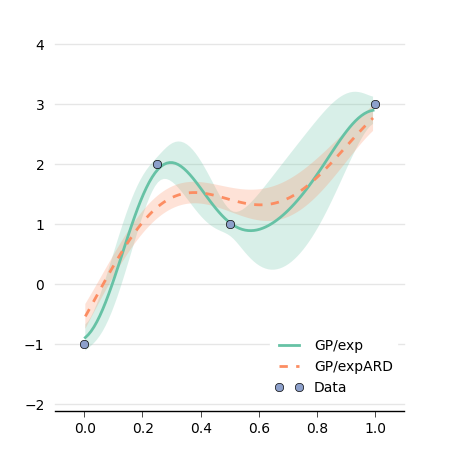

Gaussian Process
====================

Limbo relies on our C++-11 implementation of Gaussian processes (See :ref:`gaussian-process` for a short introduction ) which can be useful by itself. This tutorial will explain you how to create a Gaussian Process (GP) using some data.

Data
----
We assue that our samples are in a vector called ``samples`` and that our observations are in a vector called ``observations``. Please note that the type of both observations and samples is Eigen::VectorXd (in this example, they are 1-D vectors).

.. literalinclude:: ../../src/tutorials/gp.cpp
   :language: c++
   :linenos:
   :lines: 29-39

Basic usage
------------

We first create a basic GP with an Exponential kernel (``kernel::Exp<Params>``) and a mean function equals to the mean of the obsevations (``mean::Data<Params>``). To use the ``Exp`` kernel, we need to define one parameter in a ``Params`` structure:

.. literalinclude:: ../../src/tutorials/gp.cpp
   :language: c++
   :linenos:
   :lines: 14-16

Now we can define the type of the GP:

.. literalinclude:: ../../src/tutorials/gp.cpp
   :language: c++
   :linenos:
   :lines: 42-44

To use the GP, we need :

- to instantiante a ``GP_t`` objectives
- to call the method ``compute()``.

Here we assume that the noise is the same for all samples and that it is equal to 0.05.

.. literalinclude:: ../../src/tutorials/gp.cpp
   :language: c++
   :linenos:
   :lines: 46-53

Querying the GP can be achieved in two different ways:

- ``gp.mu(v)`` and ``gp.sigma(v)``, which returns the mean and the variance (sigma squared) for the input data point ``v``
- ``std::tie(mu, sigma) = gp.query(v)``, which returns the mean and the variance at the same time.

The second approach is faster because some computations are the same to compute ``mu`` and ``sigma``.

To write the GP in a file (to visualize it), we can query it for many points:

.. literalinclude:: ../../src/tutorials/gp.cpp
   :language: c++
   :linenos:
   :lines: 56-66

Hyper-parameter optimization
----------------------------
Most kernels have some parameters. It is common the GP literature to set them by maximizing the log-likelihood of the data knowing the model (see :ref:`gaussian-process` for a description of this concept).

In limbo, only a subset of the kernels can have their hyper-parameters optimized. The most common one is ``SquaredExpARD`` (Squared Exponential with Automatic Relevance Determination).

We define a new GP type as follows:

.. literalinclude:: ../../src/tutorials/gp.cpp
   :language: c++
   :linenos:
   :lines: 70-72

We use the default values for the parameters of ``SquaredExpARD``:

.. literalinclude:: ../../src/tutorials/gp.cpp
   :language: c++
   :linenos:
   :lines: 18-19

After calling the ``compute()`` method, we need to optimize the hyper-parameters by calling 'optimize_hyperparams()' and recomputing the GP:

.. literalinclude:: ../../src/tutorials/gp.cpp
   :language: c++
   :linenos:
   :lines: 76-78

We can have a look at the difference between the two GPs:

This plot is generated using matplotlib.

.. literalinclude:: ../../src/tutorials/plot_gp.py
   :language: python
   :linenos:
